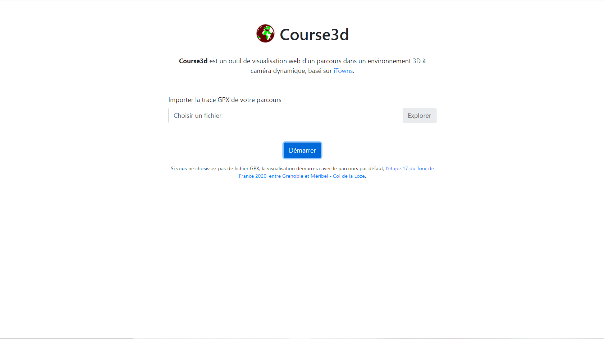
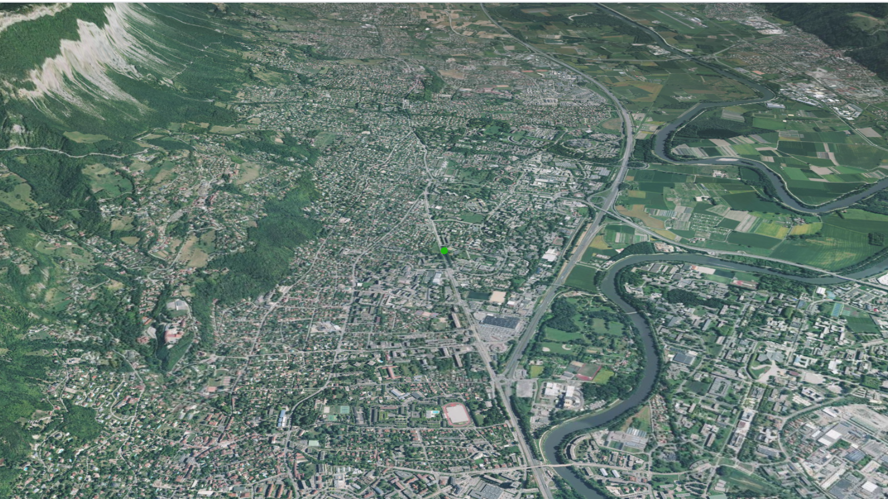
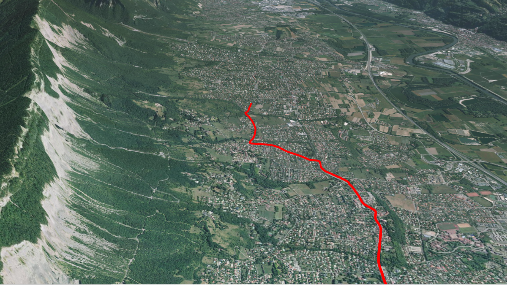
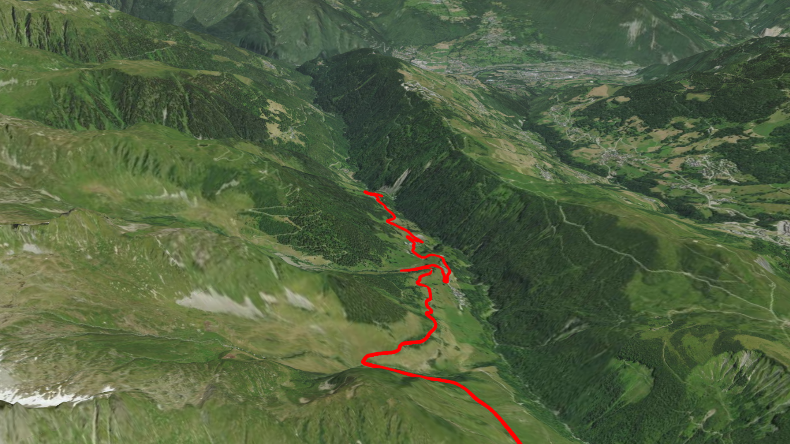

#  Course3d

**Course3d** est un outil de visualisation web d'un parcours dans un environnement 3D à caméra dynamique, basé sur [iTowns](https://github.com/iTowns/itowns).

Il a été développé dans le cadre du mini projet 3D de TSI-C 2021 à l'ENSG.

## Déploiement

**Course3d** est déployé à cette adresse : https://gaspardcothiasfaure.github.io/course3d/

## Utilisation

Pour utiliser **Course3d**, importez la trace GPX de votre parcours à l'accueil. Puis visualisez votre parcours dans un environnement 3D à caméra dynamique. 

Vous pouvez aussi visualiser le parcours par défaut proposé par **Course3d**.

Une trace GPX (différente de celle par défaut) est disponible dans ce dépôt à [./gpx/tdfcml2020.gpx](./gpx/tdfcml2020.gpx).

## Démonstration

##### Photos des différentes étapes lors de l'utilisation de Course3d :

Lorsque vous vous connectez sur le site vous arrivez sur l'acceuil, vous pouvez soit ajouter votre propre fichier GPX soit utiliser le fichier GPX test du site:
# 

Une fois votre fichier GPX entré, vous serez déplacé du globe jusqu'au premier point de votre trace GPX symbolisé par un point vert:

# 

Le chemin va alors commencer à suivre la trace GPX et la camera fera de même avec un léger retard:

# 

Toutes les 5 secondes la camera effectuera une rotation afin de s'aligner avec la tête du tracé, cela permettra d'avoir (une bonne partie du temps) le tracé récent à l'écran même dans des zones montagneuses:

# 

Enfin lorsque le tracé arrive à la fin de la trace GPX, le dernier point s'affiche en blanc et la camera s'arrête: 

# 

##### Vidéo de démonstartion :

## Installation

Le code source (JavaScript) de **Course3d** se trouve dans [./js/main.js](./js/main.js)

Pour installer **Course3d** : 

- Copiez le dépôt
- A la racine du dépot : `npm install --legacy-peer-deps`

**Course3d** utilise [Webpack](https://github.com/webpack/webpack) comme groupeur de modules JavaScript :
- Pour lancer un build en mode développement : `npm run build-dev`
- Pour lancer un build en mode production : `npm run build-prod`
- Pour lancer un build à chaque  nouvelle sauvegarde du code source : `npm run autobuild`

Dans chaque cas, un *bundle* est généré ([./dist/bundle.js](./dist/bundle.js)), il est lié aux autres fichiers statiques de **Course3d**.

## Fonctionnalités implémentées

**Course3d** permet à l'utilisateur de visualiser son parcours (importé via sa trace GPX dans le menu) dans un environnement 3D à caméra dynqmique.
Après avoir importé son tracé (ou avoir commencé avec le tracé par défaut), **Course3d** permet de visualiser :

- Une animation de caméra d'une vision du globe vers le point de départ du tracé
- Des marqueurs des points des départs et d'arrivée
- Le tracé du parcours dévoilé de façon dynamique et constante
- Le tracé depuis une caméra dynamique qui suit l'avancement du tracé

## Améliorations possibles

- Permettre à l'utilisateur :
  - De mettre en pause le dévoilement du tracé et e movement de la cméra
  - De choisir la durée du tracé et sa couleur
- Ne pas permettre à l'utilisateur de stopper la visualisation dynamique en touchant la carte 3D

## Librairies utilisées

- [iTowns](https://github.com/iTowns/itowns)

- [three.js](https://github.com/mrdoob/three.js)

- [Bootstrap](https://github.com/twbs/bootstrap)

- [tween.js](https://github.com/tweenjs/tween.js)

## Auteurs

- Gaspard Cothias Faure
- Félix Quinton
